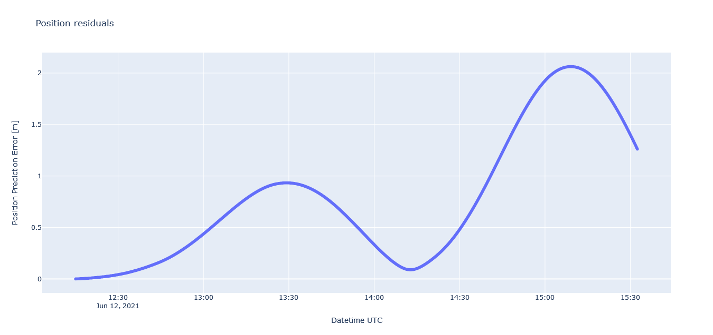

# How good is orekit ---> propagation of a LEO satellite

The example highlights a demonstration of Orekit's impressive capability to accurately predict the trajectory of a satellite in a Low Earth Orbit. Specifically, the example focuses on the prediction of the Sentinel-1 satellite's orbit, which serves as a test case for evaluating Orekit's performance. One can tune the spacecraft physical parameters for precise results.

To conduct the demonstration, the "NRT POD Restituted Orbit File"s, which contain essential data for the satellite's orbit, are obtained from the website (https://scihub.copernicus.eu/gnss/#/home). These files serve as valuable input for the prediction process, ensuring the accuracy of the projected orbit. 

Although the provided class (SentinelTest_) may not offer a wide range of options for alternative purposes, it has been purposefully customized for this demonstration. By tailoring the class to showcase the error history associated with the predicted orbit, it provides a representation of the accuracy and reliability of Orekit's propagations.

# Sample Plot

# About The Data

** DESCRIPTION

These files contain the Restituted Orbit State Vectors (OSVs) based on the orbit determination performed
by the CPOD Service. The OSVs are refered to the Centre of Gravity (CoG) of the satellite and are
expressed in the Earth-Centred, Earth-Fixed (ECEF) coordinate frame.

** DISSEMINATION

The file is made available to the PDGS of Sentinel-1 and Sentinel-2 by the CPOD Service throught the
PODIP server and it is used for generating Sentinel-1 and Sentinel-2 Mission products.
Note: for Sentinel-3, a similar file is generated by the CPOD Service (see Section 4.5 for further
information). For Sentinel-6, a similar file is generated by the CPOD Service (see Section 4.6 for further
information).

** DATA LATENCY/COVERAGE

For Sentinel-1, the file is generated within 3 hours from reception the of GNSS data in the CPOD FTP
server. One file is generated for every data dump. The file coverage is one satellite orbit, from the last
Ascending Node Crossing (ANX) present in the GNSS L0 input file plus an overlap of 593 OSVs before
the satellite orbit time span, which covers another satellite orbit. The OSVs frequency is 10 seconds.
Consecutive GNSS L0 products have a large overlap and do not cover an integer number of satellite
orbits. Only complete restituted orbit files not covered by the previous GNSS L0 product are generated
and delivered on the pick-up point following each GNSS L0 reception.

** ACCURACY

For Sentinel-1, the position accuracy threshold is 10 cm 2D 1-sigma RMS. The 2D refers to the along-
track and cross-track directions.
